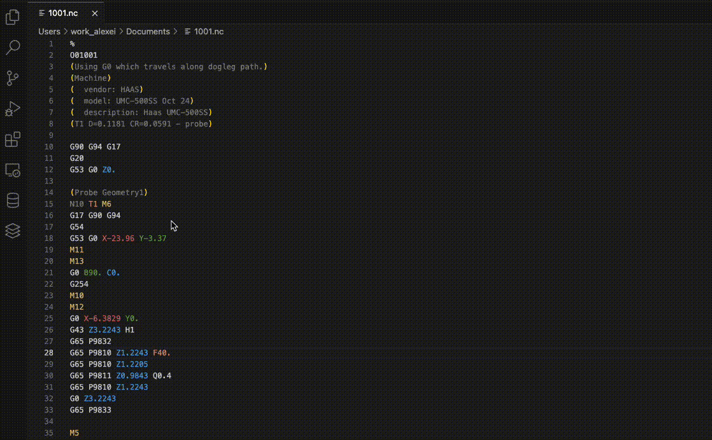

# Haas G-code Tooltips Extension

This extension provides tooltips for G-codes and M-codes within NC files generated for Haas machines such as UMC-500, VF2, etc.

When hovering over G-codes and M-codes in the NC file, the extension displays helpful tooltips with descriptions about the code function.

### Note: this is a preview extension so if it doesn't work, my deepest apologies.

_I originally built this to help me learn the gcodes/mcodes faster. I hope it helps others as well._